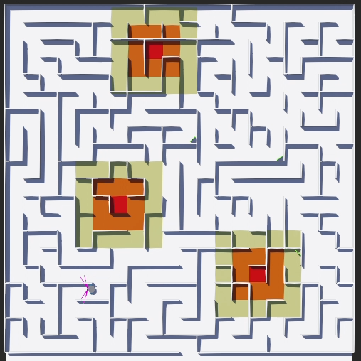

# 🏆🤖 IESL RoboGames — University Category (Semi Finals & Grand Finale)

This repository contains my solutions for the **IESL RoboGames (University Category)** across two stages:

- **Elimination (Semi-Final)** — Webots simulation: autonomous search-and-rescue in a hazardous maze.
- **Grand Finale** — Physical arena with **Kobuki (qBOTS)**: color-cube detection and sequence-wise placement.

> 📚 The task summaries below reflect the official round briefs for each stage.

---

## 📁 Repository Structure

```

IESL\_RoboGames/
├─ RoboGames - 2nd round/                 # Elimination (Semi-Final): Webots simulation project
│  ├─ controllers/                        # Controllers (C / Python)
│  ├─ worlds/                             # World(s), maze, assets
│  └─ Makefile / requirements.txt         # Build/run tooling (as applicable)
├─ Robogames - Final Round Simulation/    # Grand Finale: color-cube pipeline & test harness
│  ├─ perception/                         # Color detection / vision
│  ├─ navigation/                         # Motion logic / sequencing
│  └─ utils/                              # Common helpers
└─ README.md

````

---

## 🧭 Elimination (Semi-Final) — Webots “Rescue” Task


<div align="center">
 


</div>

### 🗺️ Problem Summary

- **Arena**: Maze **5 m × 5 m** on a **0.25 m grid**; walls **0.1 m** high, **0.01 m** thick. No wall-peeking, no climbing.  
- **Hazards**: “Fire pits” with three colored risk zones (🟥 high, 🟧 medium, 🟨 low) inflicting periodic damage while inside.  
- **Survivors**: Green squares to “rescue” by entering the cell and **holding for 3 s**.  
- **Mission**: Start with **100 marks**, rescue **3 survivors**, then **return to the entrance**.  
- **Scoring & Ties**: Marks awarded if ≥1 rescue; time is the tie-breaker; behavior outside specs may lead to penalties/disqualification.

### 🧠 Approach (High-Level)

- **Mapping**: Discretize to 0.25 m cells; inject hazard costs into the grid (risk-aware cost map).  
- **Planning**: Weighted A* (time + damage terms) with dynamic re-planning near hazards.  
- **Target Handling**: Enter survivor cell → **stabilize 3 s** → confirm → next target → **return-to-start**.  
- **Robustness**: Dead-end recovery, conservative cornering, and collision avoidance.

### 🔧 Requirements

- **Webots** (version used in development)  
- Controller toolchain: **C** (Makefile) and/or **Python** (venv) as applicable

### ▶️ How to Run (Webots)

1. Open Webots → **File → Open World…** → load `RoboGames - 2nd round/worlds/...`.  
2. Select the robot **controller** from `controllers/...`.  
3. Build (C via `make`) or run (Python) and **start the simulation**.  
4. (Optional) Use Webots recording to capture the full run 🎥.

---

## 🎨🧩 Grand Finale — Kobuki (qBOTS) “Color-Cube Sequencing” Task

<div align="center">
 


</div>

### 📋 Problem Summary

- **Arena**: Maze **10 ft × 10 ft**; start position given by officials.  
- **Task**: Detect color cubes and **place each into the matching color square in a specified sequence**.  
- **Constraint**: The robot **must stop outside** the colored squares (stopping inside → ❌ disqualification).  
- **Robot**: Official **Kobuki (qBOTS)** unit only; no code changes after placement in the arena.  
- **Evaluation**: **Completion time** is primary; code must be submitted; **collisions** may reduce marks.

### 🧠 Approach (High-Level)

- **Perception**: HSV color segmentation + size/shape checks; confidence scoring; sequence gatekeeping for the next required color.  
- **Navigation**: Obstacle-aware local planner; approach vector aligned to cube for controlled pushing; boundary-aware placement with **stop-outside** logic.  
- **Recovery**: Re-detect on occlusion, bounded retries, and safe margins at square edges.

### 🔧 Requirements

- **Kobuki (qBOTS)** base (organizers’ unit)  
- On-robot stack (e.g., Kobuki SDK/ROS) and **OpenCV** for vision  
- ⚙️ **Lighting calibration** for stable color thresholds

### ▶️ How to Run (Hardware)

1. Calibrate camera/exposure; run **color threshold calibration** if available.  
2. Deploy the controller to the Kobuki host; **do not modify code** after arena placement.  
3. Officials place at **start mark** → begin run. 🚦

---

## 🧪 Implementation Notes

- **Stack**: Mixed **C** (real-time, Webots) + **Python** (vision/utilities) + **Makefile**.  
- **Testing**:  
  - Simulation: unit tests for grid planning and risk costs.  
  - Finale: mock-tile dry-runs to tune approach/stop distances and boundary margins.

---

## ⚡ Getting Started Quickly

### 🖥️ Simulation (Webots)

```bash
# C controller (example)
cd "RoboGames - 2nd round/controllers/<controller_name>"
make
# open the corresponding world in Webots and run
````
---


## 📜 License

Licensed under the **MIT License**.

```

